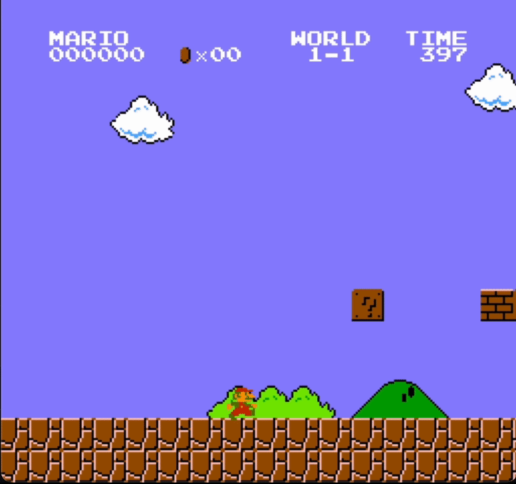
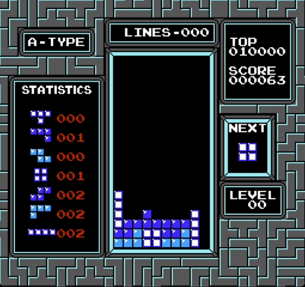

# NES Emulator in C/C++

A Nintendo Entertainment System emulator built in C/C++ with SDL for graphics. 

Currently supports Mappers 0, 1, 2, and 3.

Not yet implemented: Audio, second controller, some games in the above mappers. 

## Demos

 

